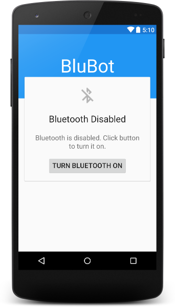
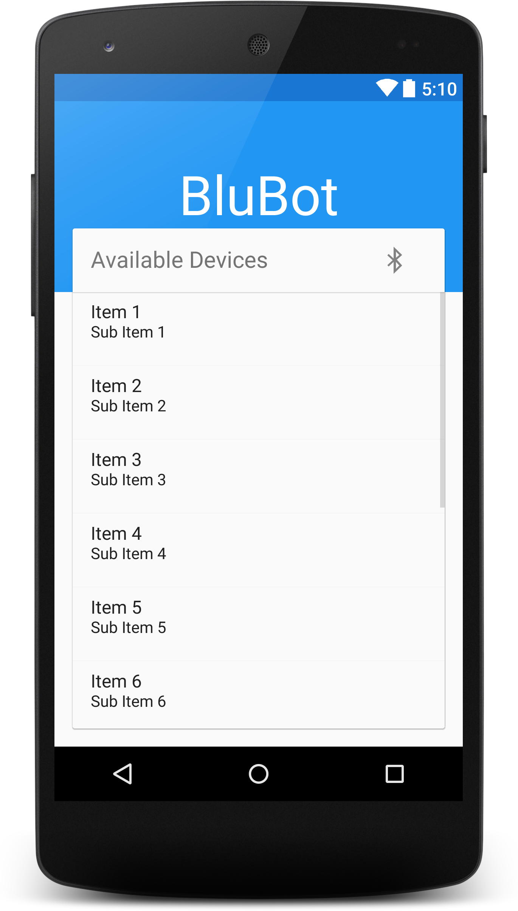
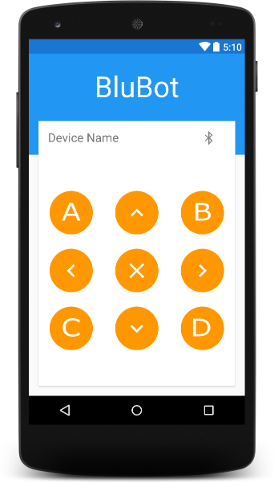
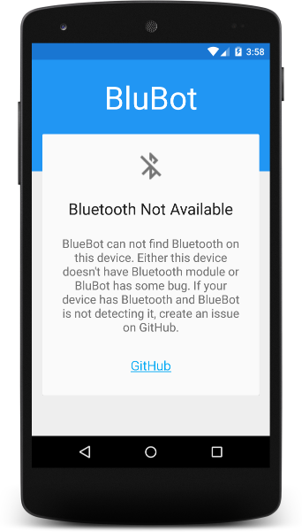

BluBot
======
Android application to connect bluetooth module and send signals.

How to use
----------
Fork on GitHub or download project and Import in Android Studio.

Libraries Used
--------------
* butterknife [Link](http://jakewharton.github.io/butterknife/)
* android-circlebutton [Link](https://github.com/markushi/android-circlebutton)

Preview
-------
* State : Bluetooth disabled.

  
  
* State : Bluetooth enabled. Searching for devices.

  
  
* State : Connected to device, specified by 'Device Name'
          Ready to send signals.

  
  
* In case Bluetooth isn't available on mobile.

  

