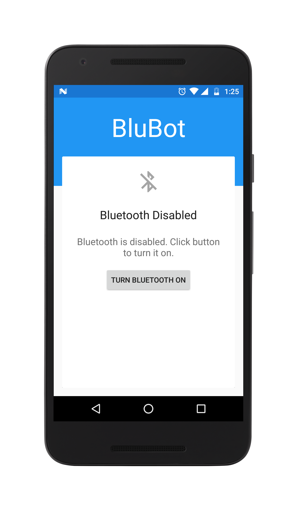
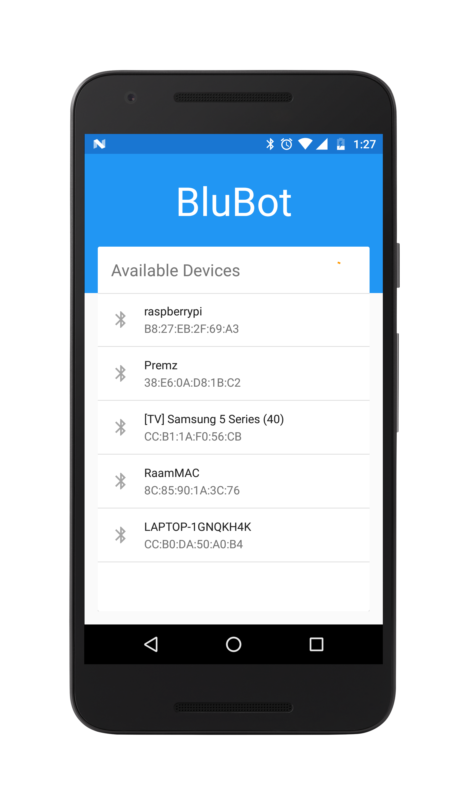
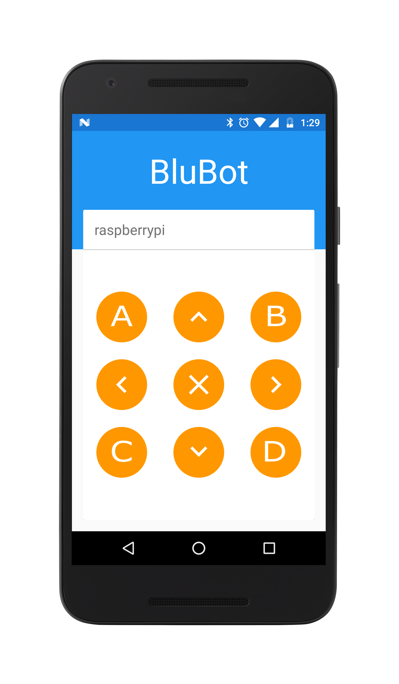
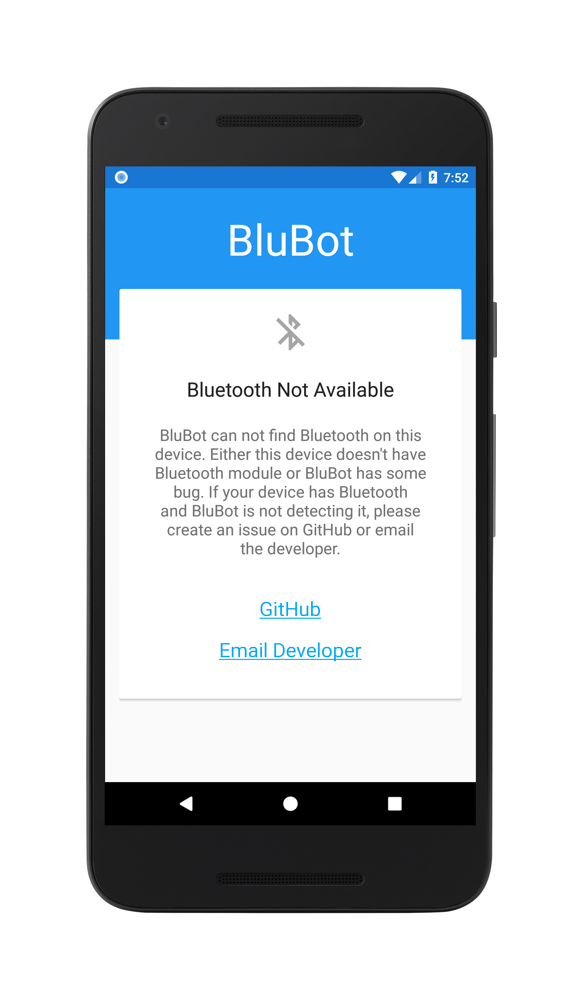

> This project is archived in favor of new app written in Kotlin.
> Visit [New Repository](https://github.com/rionlabs/blubot)

# BluBot
Android application to connect bluetooth module and send signals.

## Getting Started
Follow these steps to download and run BluBot on your local system.

1. Fork on GitHub (Optional)
2. Clone or Download project on local environment
3. Open Android Studio
4. Import by clicking `Open an existing Android Studio project`
5. Build and run on device

### Libraries Used

* [Android Support Library](https://developer.android.com/topic/libraries/support-library/index.html) by Google
* [Butterknife](http://jakewharton.github.io/butterknife/) by Jake Wharton
* [android-circlebutton](https://github.com/markushi/android-circlebutton) by Markus Hintersteiner

## Preview

| State | Screenshot
| --- | ---
| Bluetooth disabled. | 
| Bluetooth enabled. Searching for devices. | 
| Connected to device, specified by 'Device Name'. Ready to send signals. | 
| In case Bluetooth isn't available on mobile. | 

## Licence

This project is licensed under the MIT License - see the [LICENSE.md](https://github.com/rajanikantdeshmukh/BluBot/blob/master/LICENSE.md) file for details.
